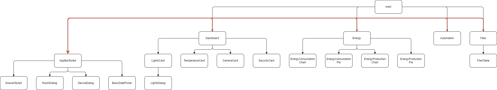

# TODO:

- Mostrar a diferença entre o produzido e o consumido, para que seja fácil perceber se o outcome é positivo ou negativo
- No date picker, faz sentido poder dar um intervalo temporal -> flr com o prof
- teus cards ficassem todos juntos uns aos outros, era para seguir um bocadinho a lógica deste site https://poki.com
- improve edit (resize de cards e por onde quiser)

- fzr variaas tabs de dashboard
- editar name dos devices
- mostrar nome do device
- selecionar no grafico - tipo escolher a cor e so aparecer essa

- tests
- upload

- energy snackbar a dizer para rodar ecra
- nos filtros por apenas as room onde esta aquele tipo de device
- graficos quando no tele roda ficam cagados, usar vw
- no calendario mobile tem 2 "-" (n me parece critico)

in add dialog we must define type and room associated
name is user writen
room is user writen but then associated

DB:
json
timeline
??
proprio file system

UI structure:



data in dashboard:

```
rooms = [ "kitchen", "bed", "ofice" ]

devices:
[
    {
        id: 1,
        type: "light",
        room: "kitchen",

        name: "Kitchen (user writen)",
        on: true,
        brightness: 100,
        color: "#FFFFFF"
    },
    {
        id: 2,
        type: "light",
        room: "bed",

        name: "Bedroom (user writen)",
        on: false,
        brightness: 100,
        color: "#FFFFFF"
    },
    {
        id: 3,
        type: "ac", // sensor temperature or ac
        room: "kitchen",

        name: "Kitchen",
        on: true,
        currentTemperature: 10,
        targetTemperature: 23,
    },
    {
        id: 4,
        type: "ac", // sensor temperature or ac
        room: "bed",

        name: "Bed (user writen)",
        on: false,
        currentTemperature: 7,
        targetTemperature: 20,
    },
    {
        id: 4,
        type: "ac", // sensor temperature or ac
        room: "bed",

        name: "Bed (user writen)",
        on: false,
        currentTemperature: 7,
        targetTemperature: 20,
    },
    { //! ATENÇAO NAO MT BEM DEFINIDO
        id: 5,
        type: "motionSensor", // security and can be used for ligths in automation
        room: "bed",

        name: "sensor bed (user writen)",
        on: true,
        detectedMotion: true,
    },
    {
        id: 6,
        type: "camera",
        room: "bed",

        on: false,
        name: "Hallway #2",
        endpoint: "c4.png",
    },
]
```

data in energy:

```
const datatmp = {
	consumption:{
		grid: [10, 2, 2, 2, 2, 2, 2, 10, 20, 30, 40, 50, 30, 30, 15, 15, 40, 40, 80, 90, 100, 60, 40, 20],
		solar: [0, 0, 0, 0, 0, 0, 10, 30, 40, 50, 60, 70, 80, 90, 120, 100, 80, 60, 30, 10, 0, 0, 0, 0],
		gas: [0, 0, 0, 0, 0, 0, 20, 40, 50, 80, 100, 70, 120, 60, 60, 80, 80, 90, 40, 30, 10, 0, 0, 0],
	},
	production: {
		solar: [0, 0, 0, 0, 0, 0, 10, 30, 40, 50, 60, 70, 80, 90, 120, 100, 80, 60, 30, 10, 0, 0, 0, 0],
		gas: [0, 0, 0, 0, 0, 0, 20, 40, 50, 80, 100, 70, 120, 60, 60, 80, 80, 90, 40, 30, 10, 0, 0, 0]
	}
}
```
