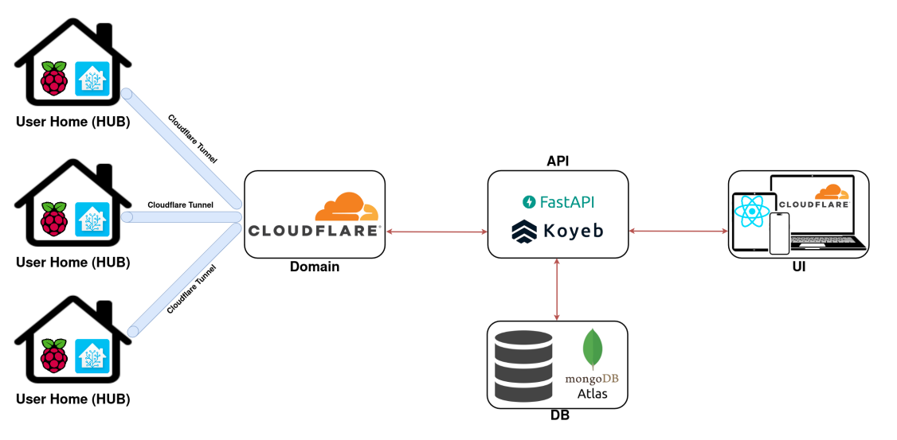

# Smartify – A User-Centric Smart Home System

Check demo -> https://www.youtube.com/watch?v=cpTlBkZe4VE

Smartify is a **smart home management system** that brings together devices from different brands and protocols into a single, user-friendly interface. It was developed as part of a dissertation project to address limitations in existing smart home solutions such as poor interoperability, lack of usability, and high costs.

##  Features

-   **Unified Control Dashboard** – Manage lights, temperature, cameras, motion sensors, alarms, and power consumption from one interface.
    
-   **Customizable UI** – Drag-and-drop cards, editable layouts, and fully personalized dashboards.
    
-   **Automation Builder** – Create advanced workflows with drag-and-drop nodes (Events, Devices, Wait, Time).
    
-   **Security & Notifications** – Integrated alarm system with real-time alerts via dashboard, email, and SMS.
    
-   **Cross-Platform Access** – Works on any device with a browser (PC, tablet, smartphone).
    
-   **Energy & History Tracking** – Monitor energy usage and device history through visual graphs.
    
-   **Multi-Protocol Support** – Compatible with Zigbee, Wi-Fi, and Bluetooth devices.
    
-   **Remote Access** – Secure external connectivity powered by **Cloudflare Tunnels**.
    

##  System Architecture

The system follows a **microservices architecture** composed of five key components:

-   **Hub** – Raspberry Pi running **Home Assistant OS**, centralizing device control.
    
-   **UI** – React-based web application for monitoring and control.
    
-   **API** – Bridges UI and Hub, handling commands and responses.
    
-   **Database** – Stores device data, history, and metrics.
    
-   **Domain** – Managed with Cloudflare for secure tunneling and alerts.
    



This approach ensures **scalability, maintainability, and strong security**.

##  User Interface

-   Built with **React** and follows CI/CD best practices.
    
-   Responsive design using **React Grid Layout**.
    
-   Supports live editing of rooms, devices, and dashboards.
    
-   Includes a **visual automation editor** for building smart workflows.
    

##  Security

-   Cloudflare Tunnels for secure external access.
    
-   OAuth2 authentication.
    
-   IP filtering for additional protection.
    

##  Future Work

-   Redundant hubs for fault tolerance.
    
-   Role-based user access levels.
    
-   Machine learning for predictive automation.
    
-   Support for scenes (e.g., _Movie Night_, _Away Mode_).
    
-   Third-party integrations (Spotify, voice assistants, etc.).
    
-   Multi-language support for global accessibility.
    

##  Demo

 [Watch the demo on YouTube](https://www.youtube.com/watch?v=cpTlBkZe4VE)

## How to Run

  

To run the project in development mode:

  

1. Install the dependencies:

  

```bash

npm install

```

  

2. Start the development server:

```bash

npm run dev

```

  

## How to deploy addon

  

1. Install the dependencies:

  

```bash

npm install

```

  

2. Build project:

  

```bash

npm run build

```

  

3. Copy the /dist folder, Dockerfile and config.yaml to Home Assistant /addons folder using Samba or SSH

  

4. The folder structure should be:

  

```bash

/addons/SmartifyUI/

├── Dockerfile

├── dist/

└── config.yaml

```

  

5. In Home Assistant frontend go to Settings -> Add-ons -> add-on store (or click here https://my.home-assistant.io/redirect/supervisor_store/)

  

6. On the top right overflow menu, click the "Check for updates" button

  

7. Refresh your webpage when needed (could be several times)

  

8. You should now see a new section at the top of the store called "Local add-ons" that lists your add-on!

  

9. Click on your add-on, then Install your add-on and then Start your add-on

  

10. Check the "Logs" tab if everything is rigth and go to http://homeassistant.local

##  Tech Stack

-   **Frontend:** React, React Grid Layout
    
-   **Backend/API:** Node.js
    
-   **Database:** MongoDB
    
-   **Hub:** Raspberry Pi + Home Assistant
    
-   **Networking:** Cloudflare Tunnel
    
-   **CI/CD:** GitHub Actions, ESLint, Prettier, Vitest
    

##  Dissertation

This project was developed as part of my dissertation:  
_“A User-Centric Smart Home System for Accessibility, Interoperability, and Monitoring”_.
